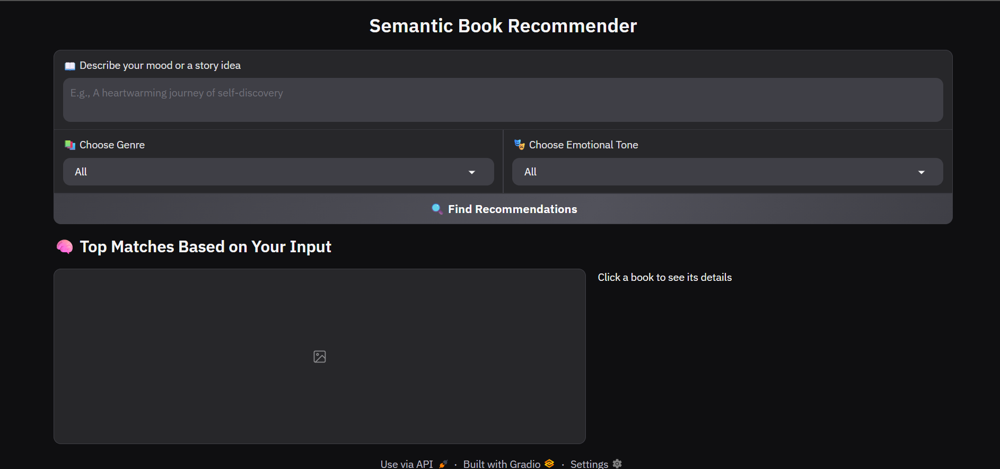
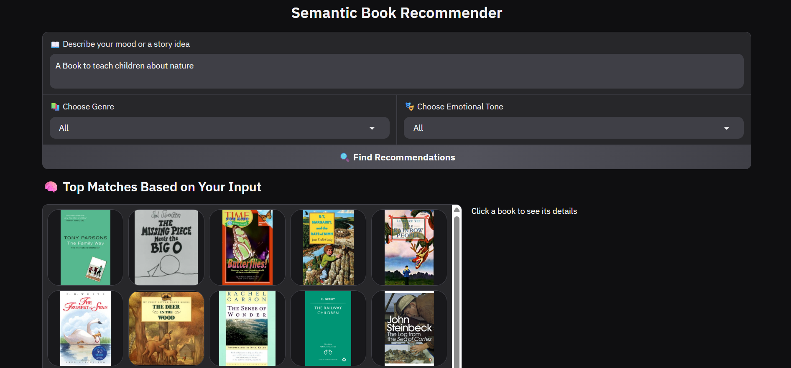
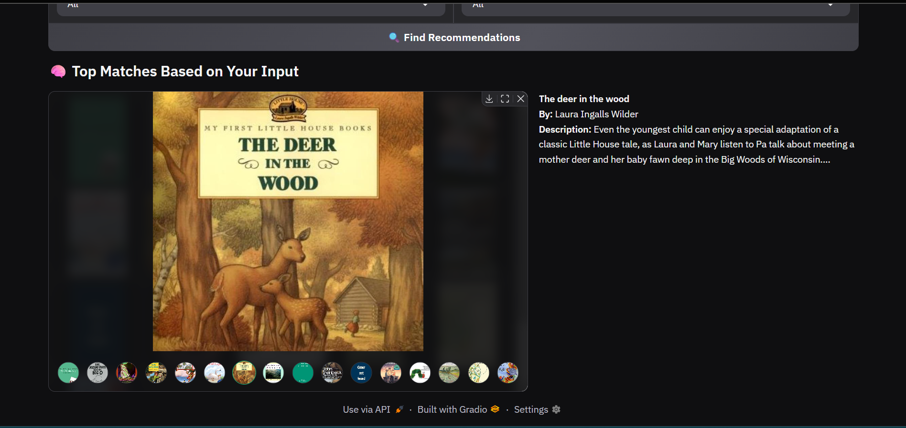

## 📚 Semantic Book Recommender System using LLM

> A smart and emotion-aware book recommendation system powered by **Large Language Models (LLMs)** and **semantic search**. Just describe your mood or a story idea, and get book suggestions tailored to your emotional tone and preferred genre!

---

## 🔍 What is this?

This is an AI-powered book recommender that uses:

* **Google Generative AI Embeddings** to understand your query semantically.
* **FAISS** for efficient similarity search over thousands of book vectors.
* A Gradio-based interactive UI.
* Emotion-based filtering (e.g., Uplifting, Thrilling, Dark, etc.).
* Real-time previews with book thumbnails and descriptions.

---

## ✨ Features

* 📖 Describe your mood or storyline idea in plain English.
* 📚 Filter results by book genre and emotional tone.
* 🎯 Get highly relevant book recommendations based on semantic meaning.
* 🖼️ See book covers and get detailed descriptions on click.
* ⚡ Fast, local search via FAISS and precomputed embeddings.
* 🌐 Intuitive web interface using Gradio.

---

## 📸 Screenshots

 
---
 
---
 
 

---

## 🧠 Tech Stack

* [Gradio](https://gradio.app) – For building the web UI.
* [LangChain](https://www.langchain.com) – Framework for LLM workflows.
* [FAISS](https://github.com/facebookresearch/faiss) – Efficient similarity search.
* [Google Generative AI](https://ai.google/discover/generative-ai/) – Text embeddings model.
* \[Pandas, NumPy] – Data handling.
